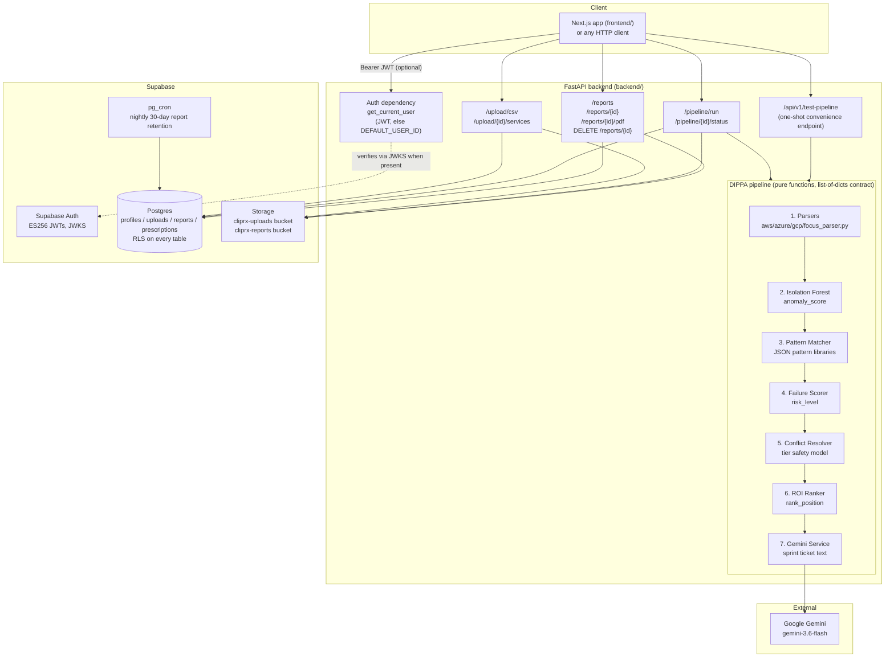
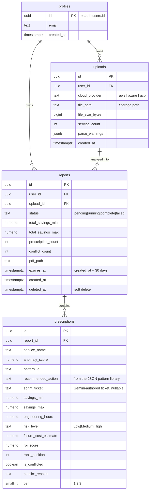
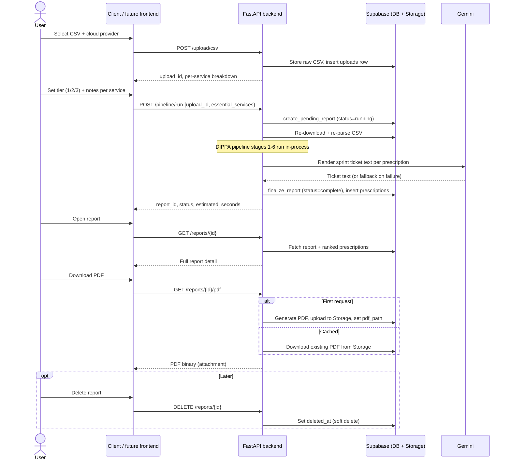

# CliPRx — Architecture & User Journey

## What this is

CliPRx ingests cloud billing CSV exports (AWS/Azure/GCP, or a vendor-neutral FOCUS 1.0 export), runs them through an ML + rules pipeline, and returns a ranked list of LLM-authored "sprint ticket" cost-optimization prescriptions. It is a FastAPI backend on Supabase (Postgres + Storage) plus Google Gemini for ticket authoring, with a Next.js frontend in `frontend/`. Everything is also reachable via direct HTTP calls (or FastAPI's auto-generated docs at `/docs`).

**Single-tenant.** The login/signup UI was removed: the frontend holds no Supabase session, and requests arriving with no `Authorization` header resolve to a fixed `DEFAULT_USER_ID` (`backend/api/auth.py`). A real Bearer token is still verified and still takes priority, so the multi-user machinery below — RLS, per-row ownership checks — remains intact and unused rather than deleted.

---

## 1. System architecture

**Key architectural notes:**
- **Auth**: `PyJWKClient` verifies Supabase-issued ES256 JWTs against the project's rotating JWKS — no shared secret. See `backend/api/auth.py`. In single-tenant mode no token is sent, so this path is dormant and `DEFAULT_USER_ID` is used instead; note this makes a deployed backend effectively open to anyone holding its URL.
- **FOCUS is provider-agnostic**: a FOCUS export can mix clouds in one file, so `focus_parser.py` stamps a per-row `detected_provider` and the pattern matcher partitions rows by it, matching each against its own provider's pattern library. Rows naming a provider it can't map are dropped before matching — `/upload/csv` reports those in its `warnings` array rather than letting them look like "analyzed, nothing found."
- **Ownership enforcement in application code**: the backend writes with the Supabase *service role* key (bypasses RLS), so every endpoint must independently verify the requesting user owns the row (`services/ownership.py`). A mismatch always returns 404, never 403, so a request can't distinguish "doesn't exist" from "exists but isn't yours."
- **No background job system**: `/pipeline/run` executes the full DIPPA pipeline synchronously in-process. `status` goes straight from `running` to `complete`/`failed`, skipping an observable `pending`.
- **Stateless re-derivation, not caching**: `/pipeline/run` doesn't need the client to re-upload — it re-downloads the original CSV from Storage and re-parses it (parsers are pure functions of the bytes), deterministically reproducing the same DataFrame.
- **Two entry points into the same pipeline**: `/api/v1/test-pipeline` (legacy, one-shot: upload+run+persist in a single call) and the split `/upload` → `/pipeline/run` flow (the real TRD-documented multi-step flow). Both call the exact same stage functions and the same `persistence.py` helpers.

---

## 2. Data model

- Every table has **Row Level Security** scoped to `auth.uid()`. `prescriptions` has no `user_id` of its own — its policy joins through `reports`.
- A Postgres trigger auto-inserts a `profiles` row on Supabase Auth signup.
- A nightly `pg_cron` job hard-deletes `reports` rows past `expires_at` (30-day retention). `deleted_at` (soft delete via the API) is separate and happens immediately on user request; hard delete via retention happens later regardless.

---

## 3. The DIPPA pipeline (stage by stage)

| # | Stage | Module | Input → Output |
|---|---|---|---|
| 1 | **D**ata Ingestion | `parsers/{aws,gcp,azure,focus}_parser.py` | Raw CSV bytes → normalized 8-column DataFrame (`service_name, cost_usd, usage_quantity, usage_type, region, billing_period_start, billing_period_end, tier`). FOCUS additionally emits `detected_provider` + `provider_name`. |
| 2 | **I**solation Forest | `ml/isolation_forest.py` | DataFrame → `+anomaly_score` (0.0–1.0, min-max normalized). <10 rows falls back to a median-multiplier heuristic. |
| 3 | **P**attern Matching | `ml/pattern_matcher.py` | Rows above `ANOMALY_THRESHOLD` (default 0.65) checked against a 30-pattern-per-provider JSON library → raw prescription dicts (savings range, eng-hours range, `immutable_blockers`) |
| 4 | **F**ailure Scoring | `ml/failure_scorer.py` | + `risk_level` (rule-based: cost>$500 → High; tier 2 + high usage variance → High; tier 2 alone → Medium; else Low), reconciled against the pattern's own `downtime_risk` by always taking the higher of the two |
| 5 | **P**revention / Conflict Resolution | `conflict_resolver.py` | Three-tier safety model: tier-1 items dropped entirely; tier-2 items whose pattern blocks tier2 flagged `is_conflicted`; any risk step-up (Low→Med, Med→High, Low→High) also flagged. Conflicted items survive, marked, not removed. |
| 6 | **A**ction Ranking (ROI) | `roi_ranker.py` | `roi_score = (avg(savings) / avg(hours)) * risk_multiplier` (1.0/0.7/0.4 for Low/Med/High); conflicted items forced to `roi_score = 0` so they sort to the bottom; `rank_position` injected |
| 7 | Actionable Insights | `services/gemini_service.py` | Each ranked prescription → Gemini-authored Jira-style sprint ticket text, persisted to `prescriptions.sprint_ticket` and shown in the report detail + PDF; falls back to a plain-text stub on any API failure. Calls run concurrently (`GEMINI_MAX_CONCURRENCY`). |

Everything flows as **a list of dicts, each stage adding/mutating keys** — there are no typed Pydantic models for prescriptions, so field names are the only contract between stages.

---

## 4. API surface

| Method | Path | Purpose |
|---|---|---|
| GET | `/health` | Liveness check |
| GET | `/auth/me` | Returns `user_id`, `email` from the verified JWT — or the `DEFAULT_USER_ID` identity when no token is sent |
| POST | `/upload/csv` | Upload a CSV (`file`, `cloud_provider`: `aws\|azure\|gcp\|focus`) → stores it, returns `upload_id`, per-service breakdown, and any non-fatal `warnings` |
| GET | `/upload/{upload_id}/services` | Re-derive the same per-service breakdown for an existing upload |
| POST | `/pipeline/run` | Run the full DIPPA pipeline against an upload, applying `essential_services` tier overrides; persists a report |
| GET | `/pipeline/{report_id}/status` | Minimal status check (`pending\|running\|complete\|failed`) |
| GET | `/reports` | List the caller's reports, newest first |
| GET | `/reports/{report_id}` | Full report detail + all prescription rows |
| GET | `/reports/{report_id}/pdf` | Branded PDF (generated once, cached in Storage, served on repeat requests) |
| DELETE | `/reports/{report_id}` | Soft delete (`deleted_at`) |
| POST | `/api/v1/test-pipeline` | Legacy one-shot: upload + run + persist in a single call |

Every error (deliberate `HTTPException` or a framework 404/validation error) is normalized to `{error, detail, code}`.

---

## 5. User journey

### Journey narrative, screen by screen

1. **Upload** (`POST /upload/csv`) — user drops a CSV and picks a provider (AWS/Azure/GCP). Backend parses it, stores the raw file, and returns a per-service cost breakdown (`service_count`, `services[]`).
2. **Essential Services Declaration** — user reviews the per-service table (`service_name`, `total_cost_usd`, `line_item_count`, `default_tier`) and adjusts tier (1 = protected/never touched, 2 = core/flagged if touched, 3 = flexible/default) plus optional notes per service. Revisiting this step later re-derives the same table via `GET /upload/{id}/services`.
3. **Run analysis** (`POST /pipeline/run`) — tier overrides are applied, then the full DIPPA pipeline runs synchronously (a few seconds). A `reports` row exists at `status=running` before the pipeline starts and flips to `complete`/`failed` when it's done — no observable `pending` state in practice.
4. **Report list** (`GET /reports`) — dashboard of past reports: status, savings range, prescription/conflict counts, created/expiry timestamps.
5. **Report detail** (`GET /reports/{id}`) — ranked prescription cards: rank, service, recommended action, the full Gemini-authored sprint ticket (collapsed behind a disclosure), savings range, effort hours, risk level, conflict flag/reason where applicable.
6. **PDF export** (`GET /reports/{id}/pdf`) — branded PDF for sharing with stakeholders; generated once and cached, so repeat downloads are instant.
7. **Delete** (`DELETE /reports/{id}`) — soft delete; the row (and its prescriptions) survive until the nightly retention job hard-deletes anything past `expires_at` (30 days from creation).

### What's deliberately *not* in the journey

- No scheduling / recurring uploads — every run is user-initiated.
- No notifications (e.g. "your report expires in 3 days").
- No team/multi-seat collaboration — single-user ownership throughout.
- No cross-report trend view — each report is a point-in-time snapshot.
- No true async job queue — `/pipeline/run` blocks until the pipeline finishes.
